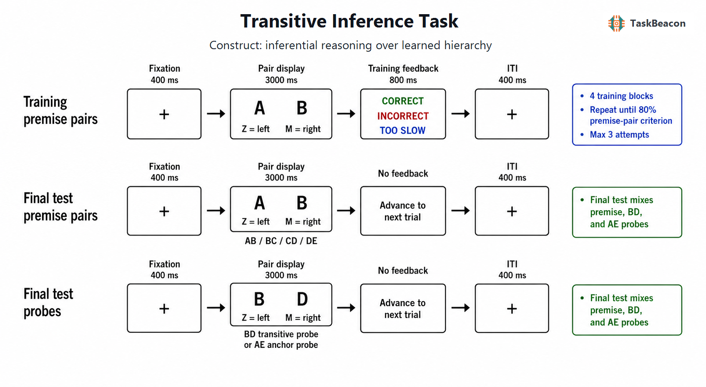

# 传递性推理任务：序列关系学习、知识整合及其测量边界

传递性推理（transitive inference, TI）指个体依据已知关系（如 A>B、B>C）判断未直接学习关系（A>C）的能力。其方法学价值在于把关系学习与新异组合上的推断置于同一实验结构中：参与者仅对相邻项目对接受训练，随后在无反馈条件下判断从未共同呈现的非相邻项目。探针正确率因而提供了从局部经验形成序列知识并迁移至新组合的行为证据。然而，同一正确选择既可能来自可陈述的线性序列表征，也可能来自刺激价值、强化史或项目熟悉度的梯度。TI 研究由此检验何种学习表征足以产生形式逻辑上正确的答案，以及不同任务操作能否区分这些表征（Frank et al., 2005; Greene et al., 2001; Smith & Squire, 2005）。

## 1. 范式提出与理论背景

儿童研究较早把传递关系视为逻辑发展指标。Bryant 与 Trabasso（1971）通过强化相邻关系并控制记忆掌握程度，表明幼儿在充分学习前提后可以完成传递判断。这一设计推动研究重点从年龄差异转向前提记忆是否充分。随后，非人动物的成对辨别研究显示鸽也能在 A>B>C>D>E 序列中选择未直接强化的 B 而非 D，并呈现端点和符号距离效应；这使“形式逻辑推演”不再是唯一解释，项目强化价值与序列位置编码成为可检验的竞争账户（von Fersen et al., 1991）。Dusek 与 Eichenbaum（1997）进一步发现海马损伤大鼠能够学习相邻辨别，却不能正常迁移至非相邻探针，为关系记忆账户提供了损伤证据。

人类非言语版本通常使用无固有次序的图形，借助相邻对的试错反馈形成隐含序列。Greene 等（2001）报告，有意识掌握序列关系者表现出较稳定的推断，但部分未报告明确意识者也能高于机会水平。后续研究表明，意识报告与成功推断关系密切，海马损伤患者在学习重叠前提和推断新关系时均受损；因此，偶发的“无意识”正确反应不足以否定陈述性关系记忆的作用（Smith & Squire, 2005）。Frank 等（2005）则用计算模型和行为实验说明，当显性序列知识受限时，分布式项目表征也可产生渐变的 TI 表现。现有理论由此形成互补而非完全互斥的解释：学习过程中可形成项目价值、具体项目对记忆和整体次序表征，测试选择由任务参数与知识掌握程度共同决定。

## 2. 任务逻辑、流程与核心指标

经典五项目版本先规定潜在次序 A>B>C>D>E，仅训练相邻前提对 AB、BC、CD、DE。每个试次呈现两个项目，要求选择序列中“较高”或“在前”的项目；左右位置随机化，以排除固定按键映射。训练阶段对选择给出正确/错误反馈，并持续至前提关系达到预定标准。测试阶段撤除反馈，混合已训练前提与新异项目对。BD 是关键传递探针：B 与 D 均为内部项目，训练中从未共同出现，正确选择 B 需要把至少 BC 与 CD 的信息推广至新组合。AE 是端点或锚点探针，虽然同样新异，但 A 始终在训练中获正反馈、E 始终获负反馈，其正确率主要反映端点价值差异，不能单独证明关系整合（von Fersen et al., 1991）。

主要因变量包括各前提对与探针对的正确率、正确反应时、遗漏率、达到学习标准所需试次或重复次数，以及按符号距离分层的选择表现。符号距离效应指项目在潜在序列中相隔越远，判断通常越快且越准确；这一效应符合按序列位置比较的表征，也可由学习所得价值差增大产生，故不是关系推理的充分证据。端点效应同样具有歧义，因为端点项目的强化史不对称。较有辨识力的分析应同时检验内部项目探针、前提掌握、符号距离、项目位置和个体的显性序列知识，并避免将 AE 与 BD 合并为一个“推理正确率”（Jensen et al., 2017）。

训练制度会改变可识别的心理过程。逐项或分阶段教授前提可能加强相邻项目对记忆；随机交错训练更有利于跨前提比较。训练到标准减少因前提遗忘造成的假阴性，却也延长强化史并提高形成显性序列的机会。测试中继续提供反馈会把探针转化为新的学习试次，因而经典推断测量通常对非相邻对停用反馈。刺激同时呈现时，反应主要依赖已学知识的检索与比较；延迟呈现版本额外增加工作记忆要求，不能与同时呈现版本直接等同（Kay et al., 2024）。

## 3. 行为机制与神经科学证据

### 3.1 关系表征、强化学习与策略异质性

TI 的关键对比是新异内部项目对相对于已学相邻对的表现，而不是总体正确率。BD 高于机会水平且前提已充分掌握，支持知识迁移至未训练组合；若只在 AE 上表现良好，则刺激强化史已足以解释选择。显性排序报告、策略描述或信心判断可帮助区分可陈述关系知识与较隐性的项目价值，但事后报告本身可能遗漏测试时使用的策略。实验还应控制前提难度，因为内部前提（尤其与 BD 直接相关的 BC、CD）掌握不足会系统性压低推断表现（Wright, 2021）。

近年来，强化学习模型对“关系推断必须在线拼接情景记忆”的强解释提出了更具体的替代方案。Ciranka 等（2022）在四项人类实验中发现，当反馈只覆盖相邻项目时，胜者与败者采用不同学习率的非对称更新，比对称更新更能描述选择；这种偏置可压缩主观价值空间，却有利于从稀疏局部反馈推广至远距离关系。Graham 与 Spitzer（2025）进一步操控序列结构的变化方向，发现胜者偏向使项目上移比下移更易更新，并影响未改变项目间的推断。上述结果说明相同的 BD 正确选择可能由显性关系图、项目级价值梯度或二者混合产生；若研究目标是区分机制，应采用试次级建模、结构重估或反馈操控，而非仅比较平均正确率。

训练和提取安排亦会改变推断。Mulligan 等（2023）发现，能强化单个前提记忆的提取练习并不必然促进跨前提整合，某些条件下反而损害 TI。这一区分提示前提记忆强度与关系可组合性不是同一构念。神经网络建模也显示，多种内部动力学均可在新组合上达到高正确率，并复现符号距离等行为特征；模型行为等价并不意味着其表征机制相同（Kay et al., 2024）。

### 3.2 fMRI 与 EEG 所揭示的阶段性过程

早期功能磁共振成像（functional magnetic resonance imaging, fMRI）研究在学习后的非相邻判断中观察到双侧前额叶、顶叶及相关运动准备区域活动，支持推断阶段需要关系信息的检索、比较和决策控制（Acuna et al., 2002）。海马活动与成功的 TI 判断相关，且海马与尾状核的贡献随关系策略和项目强化策略而变化，提示任务不是由单一脑区独立完成（Heckers et al., 2004; Moses et al., 2010）。Wendelken 与 Bunge（2010）进一步区分海马对关系检索的贡献与额极外侧前额叶对多关系整合的贡献。Garvert 等（2017）利用多变量表征分析发现，学习后的海马—内嗅系统能够表征抽象关系距离，为认知地图式序列编码提供了空间分布证据。

包含 32 项 fMRI 研究的坐标元分析显示，层级与联想型传递推理共同涉及海马、内侧前额叶和后扣带区域，层级推理还较稳定地招募顶叶及动作选择相关区域；不同范式和基线对激活分布有实质影响（Zhang et al., 2022）。这些结果支持记忆检索、关系整合和选择控制的网络协作，但血氧水平依赖（blood-oxygen-level-dependent, BOLD）差异不能单独证明某一区域对推断具有因果作用，也不能判定参与者使用显性序列还是价值比较。

脑电图（electroencephalography, EEG）为关系整合的时间进程提供补充证据。在语言—空间前提版本中，可与首个前提整合的第二前提诱发 P3b，而无法整合的前提诱发类似 P600 的成分，说明整合可在结论判断前数百毫秒内改变事件相关电位（event-related potential, ERP）（Bonnefond et al., 2014）。该研究使用显式呈现的空间关系前提，和依靠多轮反馈习得任意符号序列的五项目版本不同；其 ERP 结果支持“关系可整合性”具有可分辨的时间效应，但不能直接指定 TaskBeacon 版本中 BD 选择的神经来源。

## 4. 范式发展与主要应用

TI 已从儿童逻辑测验发展为跨物种关系记忆、决策学习和抽象认知地图研究的共同范式。发展研究显示，任务格式会改变儿童表现及其年龄关系。Wright（2021）比较三项式无训练任务与五项式强化学习任务后指出，两者可能分别偏重分析式关系整合和渐进式联结学习；因而不同版本不宜以同一“传递能力”量尺直接排序。对儿童、老年人或临床群体的研究还必须分离基本辨别学习、反馈利用、工作记忆、运动反应和推断迁移，群体在 BD 上的差异不能直接视为特异性海马功能指标。

跨物种应用借助相同的相邻训练—非相邻测试结构比较关系泛化，同时揭示强化史的替代解释。大量强化某一前提后，人类与恒河猴仍可对新异非相邻项目作出系统判断，说明简单累计奖励并不足以解释全部表现；但项目价值更新模型仍可解释许多距离和端点模式（Jensen et al., 2017）。近期灵长类综述将 TI 视为研究记忆驱动决策及前额叶—海马协作的可操作模型，同时强调训练程序、序列长度和物种经验的差异限制直接类比（Ramawat et al., 2023）。

## 5. 测量效度与解释边界

TI 对“已学局部关系能否支持新组合选择”具有明确的操作效度，但对单一心理机制的构念效度有限。BD 只提供八次或少量二元试次时，个体得分分辨率低，二项抽样误差较大；达到标准后的天花板效应也会压缩个体差异。现有任务特异文献对标准五项目版本的重测信度报告不足，且重复测量会保留序列学习或促使策略显性化。因此，该范式较适合检验组水平操控效应和试次级学习模型，不宜在缺少独立信度证据时用于个体诊断或稳定特质排序。

内部效度主要受四类因素制约。其一，前提未掌握会制造推断失败，故应报告每一前提对而非仅总体训练正确率。其二，端点强化不对称和符号距离可由项目价值模型解释，关键结论应优先依赖内部非相邻探针并结合模型比较。其三，显性觉察、空间序列表象和语言化策略会随指导语及训练量变化；这些策略是真实任务解法，却限制将结果归因于隐性关系学习。其四，不同研究采用同时或连续呈现、确定性或概率性反馈、训练后测试或学习中穿插探针，所得效应并非同一测量。可靠的设计应预先界定推断指标，增加独立探针数量或多条序列，记录显性知识，并检验结论对前提表现、反应时与模型设定是否稳健。

## 6. TaskBeacon 中的任务实现

### 6.1 任务资源与访问入口

| 资源 | ID | 用途 | 地址 |
|---|---|---|---|
| 完整实验源码 | T000052 | PsychoPy/PsyFlow 行为实验实现 | [GitHub](https://github.com/TaskBeacon/T000052-transitive-inference-task) |
| 浏览器伴随源码 | H000052 | `psyflow-web` 行为型浏览器预览；训练块为静态单次呈现 | [GitHub](https://github.com/TaskBeacon/H000052-transitive-inference-task) |

截至核验时，H 仓库未提供可验证的公开直运行地址。网页版本保留条件、时序、反应与计分，但不执行 T 版本的训练块动态重复，因而不能替代完整实验实现中的达标控制。

### 6.2 实现流程与关键参数

TaskBeacon 当前版本采用五个平假名构成固定潜在序列 `ろ>ま>か>め>せ`。四个训练块均包含 40 个试次，依次采用成组、较短周期、逐对周期和完全随机的安排；每一训练块结束后分别计算 AB、BC、CD、DE 正确率，任一对低于 80% 时重复该块，单块最多运行三次。因此配置中声明的 208 个基础试次由 160 个训练试次和 48 个末测试次构成，实际总量可因重复训练而增加。末测将四种前提对、BD 推理探针和 AE 锚点探针各呈现八次，并停止反馈。系统记录项目对、条件、左右位置、按键、正确性、反应时与遗漏，可分别估计前提保持、内部传递判断和端点判断。

*图 1. TaskBeacon 当前实现的训练与测试流程。每个试次依次呈现 400 ms 注视点、最长 3000 ms 的双项目选择界面和 400 ms 试次间隔；参与者按 Z 选择左侧、按 M 选择右侧，左右位置按试次随机化。训练条件只呈现相邻对 AB、BC、CD、DE，选择序列中较前项目为正确，随后显示 800 ms 的“正确”“错误”或“太慢”反馈；每个训练块按各前提对 80% 标准判断是否重复，最多三次。末测无反馈，混合相邻前提、BD 内部传递探针（应选 B）与 AE 端点探针（应选 A），每类项目对各八次。*

该实现是同时呈现、确定性反馈的行为版本。BD 正确率是最直接的推断指标，AE 正确率应作为端点强化对照解释；四个前提对的末测保持率用于判断推断错误是否源于知识遗忘。由于仅有一个内部非相邻项目对，若研究目标涉及个体差异、临床分类或参数化符号距离效应，宜扩展序列或增加独立探针，并在修改后重新评估学习标准和测量信度。

## 参考文献

Acuna, B. D., Eliassen, J. C., Donoghue, J. P., & Sanes, J. N. (2002). Frontal and parietal lobe activation during transitive inference in humans. *Cerebral Cortex, 12*(12), 1312–1321. https://doi.org/10.1093/cercor/12.12.1312

Bonnefond, M., Castelain, T., Cheylus, A., & Van der Henst, J.-B. (2014). Reasoning from transitive premises: An EEG study. *Brain and Cognition, 90*, 100–108. https://doi.org/10.1016/j.bandc.2014.06.010

Bryant, P. E., & Trabasso, T. (1971). Transitive inferences and memory in young children. *Nature, 232*(5311), 456–458. https://doi.org/10.1038/232456a0

Ciranka, S., Linde-Domingo, J., Padezhki, I., Wicharz, C., Wu, C. M., & Spitzer, B. (2022). Asymmetric reinforcement learning facilitates human inference of transitive relations. *Nature Human Behaviour, 6*(4), 555–564. https://doi.org/10.1038/s41562-021-01263-w

Dusek, J. A., & Eichenbaum, H. (1997). The hippocampus and memory for orderly stimulus relations. *Proceedings of the National Academy of Sciences of the United States of America, 94*(13), 7109–7114. https://doi.org/10.1073/pnas.94.13.7109

Frank, M. J., Rudy, J. W., Levy, W. B., & O’Reilly, R. C. (2005). When logic fails: Implicit transitive inference in humans. *Memory & Cognition, 33*(4), 742–750. https://doi.org/10.3758/BF03195340

Garvert, M. M., Dolan, R. J., & Behrens, T. E. J. (2017). A map of abstract relational knowledge in the human hippocampal–entorhinal cortex. *eLife, 6*, e17086. https://doi.org/10.7554/eLife.17086

Graham, T. A., & Spitzer, B. (2025). Asymmetric learning and adaptability to changes in relational structure during transitive inference. *Communications Psychology, 3*, Article 155. https://doi.org/10.1038/s44271-025-00352-0

Greene, A. J., Spellman, B. A., Dusek, J. A., Eichenbaum, H. B., & Levy, W. B. (2001). Relational learning with and without awareness: Transitive inference using nonverbal stimuli in humans. *Memory & Cognition, 29*(6), 893–902. https://doi.org/10.3758/BF03196418

Heckers, S., Zalesak, M., Weiss, A. P., Ditman, T., & Titone, D. (2004). Hippocampal activation during transitive inference in humans. *Hippocampus, 14*(2), 153–162. https://doi.org/10.1002/hipo.10189

Jensen, G., Alkan, Y., Muñoz, F., Ferrera, V. P., & Terrace, H. S. (2017). Transitive inference in humans (*Homo sapiens*) and rhesus macaques (*Macaca mulatta*) after massed training of the last two list items. *Journal of Comparative Psychology, 131*(3), 231–245. https://doi.org/10.1037/com0000065

Kay, K., Biderman, N., Khajeh, R., Beiran, M., Cueva, C. J., Shohamy, D., Jensen, G., Wei, X.-X., Ferrera, V. P., & Abbott, L. F. (2024). Emergent neural dynamics and geometry for generalization in a transitive inference task. *PLOS Computational Biology, 20*(4), e1011954. https://doi.org/10.1371/journal.pcbi.1011954

Moses, S. N., Brown, T. M., Ryan, J. D., & McIntosh, A. R. (2010). Neural system interactions underlying human transitive inference. *Hippocampus, 20*(8), 894–901. https://doi.org/10.1002/hipo.20735

Mulligan, N. W., Buchin, Z. L., & Powers, A. (2023). Transitive inference and the testing effect: Retrieval practice impairs transitive inference. *Quarterly Journal of Experimental Psychology, 76*(10), 2356–2370. https://doi.org/10.1177/17470218231156732

Ramawat, S., Marc, I. B., Ceccarelli, F., Ferrucci, L., Bardella, G., Ferraina, S., Pani, P., & Brunamonti, E. (2023). The transitive inference task to study the neuronal correlates of memory-driven decision making: A monkey neurophysiology perspective. *Neuroscience & Biobehavioral Reviews, 152*, 105258. https://doi.org/10.1016/j.neubiorev.2023.105258

Smith, C., & Squire, L. R. (2005). Declarative memory, awareness, and transitive inference. *The Journal of Neuroscience, 25*(44), 10138–10146. https://doi.org/10.1523/JNEUROSCI.2731-05.2005

von Fersen, L., Wynne, C. D. L., Delius, J. D., & Staddon, J. E. R. (1991). Transitive inference formation in pigeons. *Journal of Experimental Psychology: Animal Behavior Processes, 17*(3), 334–341. https://doi.org/10.1037/0097-7403.17.3.334

Wendelken, C., & Bunge, S. A. (2010). Transitive inference: Distinct contributions of rostrolateral prefrontal cortex and the hippocampus. *Journal of Cognitive Neuroscience, 22*(5), 837–847. https://doi.org/10.1162/jocn.2009.21226

Wright, B. C. (2021). Towards a resolution of some outstanding issues in transitive research: An empirical test on middle childhood. *Learning & Behavior, 49*(2), 204–221. https://doi.org/10.3758/s13420-020-00440-7

Zhang, X., Qiu, Y., Li, J., Jia, C., Liao, J., Chen, K., Qiu, L., Yuan, Z., & Huang, R. (2022). Neural correlates of transitive inference: An SDM meta-analysis on 32 fMRI studies. *NeuroImage, 258*, 119354. https://doi.org/10.1016/j.neuroimage.2022.119354
